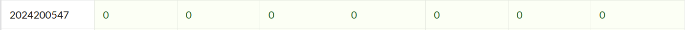
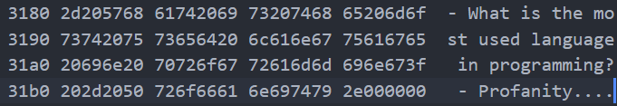
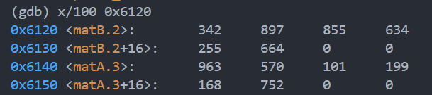

# bomblab 报告

姓名：刘梓昱

学号：2024200547

| 总分 | phase_1 | phase_2 | phase_3 | phase_4 | phase_5 | phase_6 | secret_phase |
| --------- | ------------- | ------------- | ------------- | ----------------- |-----------|-----------|-----------|
| 7       | 1            | 1            | 1            | 1 |1  |1  |1  |

scoreboard 截图：



## 解题报告

### phase_1

#### 答案：

```c
- What is the most used language in programming? - Profanity.
```

第一题是字符串匹配，直接在3180查看对应的字符串即可。




### phase_2

#### 答案：

```c
842451 1292255 403458 784343
```

源代码：

```c
int phase_2()
{
    int input[2][2]={0};
    if(scanf("%d %d %d %d",&input[0][0],&input[0][1],&input[1][0],&input[1][1])!=4)
    {
        explode_bomb();
    }
    int matA[2][3]={{963,570,101}
                    {199,168,752}};
    int matB[3][2]={{342,897}
                    {855,634}
                    {255,664}};
    int result[2][2]=0;
    for(int i=0;i<2;i++)
    {
        for(int j=0;j<2;j++)
        {
            temp=0;
            for(int k=0;k<3;k++)
            {
                temp+=matA[i][k]*matB[k][j];
            }
            temp=result[i][j];
        }
    }
    for(int i=0;i<0;i++)
    {
        for(int j=0;j<2;j++)
        {
            if(result[i][j]!=temp[i][j])
            {
                explode_bomb()
            }
        }
    }
    return 0;
}
```

本题是一个矩阵乘法。两个矩阵分别是2×3和3×2的，输入的四个数为两个矩阵相乘后的结果。我们在6120和6140分别查看两个矩阵的值，然后手动计算后输入即可。矩阵内容如下：



### phase_3

#### 答案：

```c
0 641
```

源代码：

```c
int phase_3()
{
    int a,b;
    if(scanf("%d %d",&a,&b)<=1)
    {
        explode_bomb();
    }
    
    if(a>7)
    {
        explode_bomb();
    }
    
    int result;
    switch(a)
    {
        case 0:
            result=831-190;
            break;
            
        case 1:
            result=700-190;
            break;
            
        case 2：
            result=350-190;
            break;
            
        case 3:
            result=786-190;
            break;
            
        case 4:
            result=193-190;
            break;
        
        case 5:
            result=640-190；
            break;
            
        case 6:
            result=173-190;
            break;
            
        case 7:
            result=216-190;
            break;
            
        default:
            explode_bomb();
    }
    
    if(b<0)
    {
        explode_bomb();
    }
    
    if(b!=result)
    {
        explode_bomb();
    }
    
    return 0;
}
```

本题是一个跳转语句，根据输入的数字选择跳转路径。输入的两个值分别是case的值和对应的结果。case0-case7的结果是分别是七个数减去一个固定的dealt，dealt位于0x6110，查看后发现是0xbe，即190。由于第二个参数不能为负数，而case6结果为负，因此case6为无效路径，会爆炸，其余路径均可过关。


### phase_4

#### 答案：

```c
31 AB
```

通过第三题之后会输出：Halfway there!  Ancient monks moved sacred disks between poles...

这提示我们第四题应该是一个汉诺塔，主要考察递归相关内容。func4_1和func4_2分别对应步数和具体的移动过程。

源代码：

```c
int func4_1(int n)
{
    if(n<=0)
    {
        return 0;
    }
    
    else if(n==1)
    {
        return 1;
    }
    
    else
    {
        return 2*func4_1(n-1)+1;
    }
}
```

func4_1是汉诺塔的步数递推公式。


```c
void func4_2(int n; int len; char src; char dest; char axu; char *buffer)
{
    if (n == 1) 
    {
        buffer[0] = src;
        buffer[1] = dest;
        return;
    }
    
    int steps=func4_1(n-1);
    
     if (steps >= len) 
     {
        func4_2(n-1, len, src, aux, dest, buffer);
    }
    else if ((steps + 1) == len) 
    {
        buffer[0] = src;
        buffer[1] = dest;
    }
    else //本题中没有用到
    {
        int new_len = len - steps - 1;
        func4_2(n-1, new_len, dest, aux, src, buffer);
    }
    return ;
}
```

func4_2是汉诺塔递归的具体过程。n是圆盘数，len是字符串长度，buffer是得到的字符串。这里我们已知len=2，因此将buffer设置为两个索引。


```c
int phase_4()
{
    int num;
    char str[2];
    char result[2];
    if(scanf("%d %s",&num,str)!=2)
    {
        explode_bomb();
    }
    
    if(num!=func4_1(5))
    {
        explode_bomb();
    }
    
    if(string_length(str)!=2)
    {
        explode_bomb();
    }
    
    func4_2(5,2,'A','C','B',result);
    
    if(string_not_equal(str,result)!=0)
    {
        explode_bomb();
    }
    
    return 0;
}
```

phase_4的部分就是对两个函数的调用。

本题其实可以通过设置断点然后查看寄存器寻找答案。输入31和任意的字符串，然后在explode_bomb设置断点，查看寄存器%rsi的值，rsi的值就是需要输入的字符串。


### phase_5

#### 答案：

```c
-2 21
```

源代码：

```c
int phase_5()
{
    int array[16]={10,2,14,7,8,12,15,11,0,4,1,13,3,9,6,5}
    int a,b;
    if(scanf("%d %d",a,b)<=1)
    {
        explode_bomb();
    }
    
    if(a>=0) // 第一个数需要为负
    {
        explode_bomb();
    }
    
    a&=0xf; // 负数通过位或转换为正
    if(a==0xff) 
    {
        explode_bomb();
    }
    
    int count=0;
    int sum=0;
    
    while(1)
    {
        count++;
        a=array[a];
        sum+=a;
        if(a==15)
        {
            break;
        }
    }
    
    if(count!=2)
    {
        explode_bomb();
    }
    
    if(sum!=b)
    {
        explode_bomb();
        
        return 0;
    }
}
```

本题是一个数组的循环遍历。我们需要输入两个参数。第一个参数作为数组的索引进行循环，循环的过程中把第一个参数更新为该索引对应的数组值，然后将数组值累加。最后通过判断循环次数是否为2，以及输入的第二个参数是否为等于数组值累加来判断爆炸。

本题非常反常识的地方在于输入的第一个参数应该为负数，然后通过和0xf进行位或来转换为整数。我们通常下意识认为负数会跳转到爆炸。做题的时候在这里卡了好久，开始一直没发现为什么错了。


### phase_6

#### 答案：

```c
3 4 6 5 2 1
```

源代码：

```c
int phase_6()
{
    int num[6];
    read_six_numbers(num[0],num[1],num[2],num[3],num[4],num[5]);
    for (int i = 0; i < 6; i++) 
    {
        if ((num[i]-1)>5) 
        {
            explode_bomb();
        }
        for (int j = i + 1; j < 6; j++) 
        {
            if (input[i] == input[j]) 
            {
                explode_bomb();
            }
        }
    }

    Node *node; //旧链表
    Node *new_nodes; //新链表
    for(int k=0;k<6;k++)
    {
        new_nodes[k]=node[num[k]]; //排序
    }

    for (int i = 0; i < 6; i++) 
    {
        new_nodes[i]->next=new_nodes[i+1]; //链接链表
    }
    new_node[6]->next = NULL;

    for (int i = 0; i < 5; i++) 
    {
        if (current->data < current->next->data) //是否降序排列
        {
            explode_bomb();
        }
        current = next_node;
    }
}
```

本题是一个链表排序问题。我们只需要保证输入的链表节点顺序对应的数值是从大到小排列即可。直接查找链表内容然后输入排序结果即可过关。需要注意链表中的元素不是地址不是连续的。第六个节点和前五个不在一起，需要分别查找。


### secret_phase

#### 答案：

```c
ccaac
```

进入secret_phase需要在第六题的答案后面加上Secret word。

源代码：

```c
int phase_7()
{
    int board[8][8]={......}; // 此处省略具体的棋盘结构 
    int step[8][4]={......}; // 此处省略八种走法和绊马腿
    
    // 移动函数
    int check_step(int x, int y, int step) 
    {
        //步数超过20则失败
        if (step > 20) 
        {
            return 0;
        }

        char op_char = input[step];
        int op = op_char & 0x7; // 低3位为移动方向

        int new_x = x + step[op][0];
        int new_y = y + step[op][1];

        // 出界则失败
        if (new_x < 0 || new_x >= 8 || new_y < 0 || new_y >= 8) 
        {
            return 0;
        }

        int block_x = x + step[op][2];
        int block_y = y + step[op][3];
        
        // 绊马腿检测，如果被绊了则失败
        if (block_x >= 0 && block_x < 8 && block_y >= 0 && block_y < 8) 
        {
            if (board[block_x][block_y] == 1) 
            {
                return 0;
            }
        }

        // 踩到障碍了则失败
        if (board[new_x][new_y] == 1) 
        {
            return 0;
        }

        // 到达目标位置则成功
        if (new_x == 4 && new_y == 7) 
        {
            return 1;
        }

        // 递归
        return check_step(new_x, new_y, step + 1);
    }

    // 初始位置(0,0)，初始步数0,移动函数返回值为0则爆炸，不为0则过关
    if(check_step(0, 0, 0)==0)
    {
        explode_bomb();
    }
    else
    {
        return 0；
    }
}

```

本题是一个下棋游戏，棋子从（0，0）开始，只能走中国象棋的马步，而且不能够被绊马腿。一个8×8的棋盘上有些格子是障碍物，棋子不能走到障碍物，也不能走出棋盘的边界，最后在20步以内走到（4，7）就可以结束游戏。输入的字符的ascll码的低三位为移动方向。函数返回值不为0则过关，为0则爆炸。


## 反馈/收获/感悟/总结

感觉bomblab难度总体还是挺大的，寄存器和跳转让人看的头大，第一题确实说的很对，程序员用的最多的语言是Profanity（bushi)。

感觉除了翻译汇编，多尝试反汇编非常有用，像第四，六题都可以不看懂代码而简单找到答案。secret只要能看出来移动规则和棋盘构造也可以直接解出来，而不是逐句翻译。从地址中查看数据然后直接找出答案也是很有趣的过程。

关于爆炸，其实感觉炸弹扣分这个东西并没有什么意义，因为只需要打断点就可以避免，只要不手贱就不会爆炸。

题目确实加深了我对汇编的理解，是对汇编很好的复习，考察的内容也很全面，是一个很有趣的lab。在做题过程中我也对编程有了新的感受，比如scanf为什么要加&，以及链表和数组的存储结构。

## 参考的重要资料

csapp课本，以及实验手册的反汇编方法。
